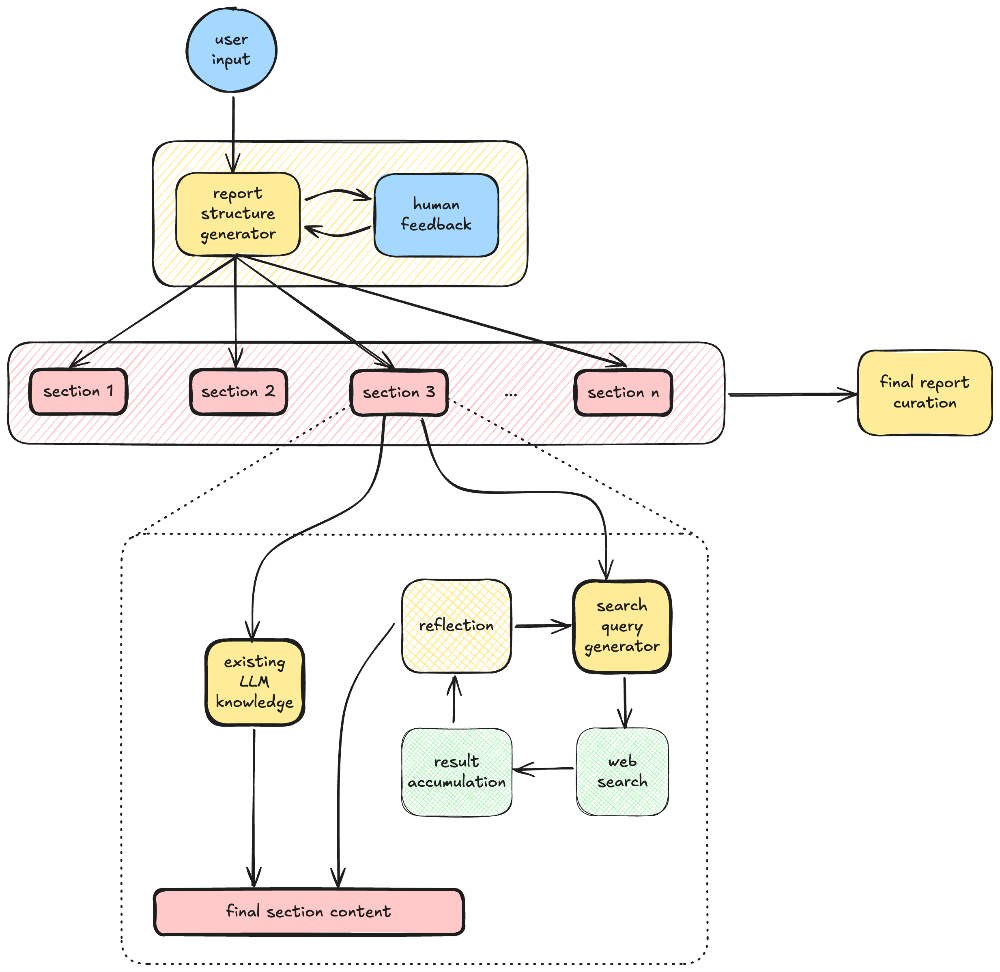

# Deep Research

A sophisticated research automation tool that leverages LangChain and LangGraph to conduct in-depth research on any topic. The system uses multiple AI agents working together to gather information, analyze data, and generate comprehensive research reports.

## Prerequisites

- Python 3.12 or higher
- Poetry for dependency management
- API keys for:
  - OpenAI
  - Anthropic
  - Google AI
  - Tavily (Mandatory)

The API key of the LLM provider is optional based on which model you wish to use.

## Installation

1. Clone the repository:
```bash
git clone https://github.com/psykick-21/deep-research.git
cd deep-research
```

2. Create a virtual python environment in this repo
```bash
conda create -p venv python=3.12 -y
```

Any other method can also be used to create python environment.

3. Activate python environment
```bash
conda activate ./venv
```

4. Install `poetry` in the environment if you are not using global poetry config
```bash
pip install poetry
```

5. Install dependencies using Poetry:
```bash
poetry install
```

6. Create a `.env` file in the project root with your API keys:
```
OPENAI_API_KEY=your_openai_key
ANTHROPIC_API_KEY=your_anthropic_key
GOOGLE_API_KEY=your_google_key
TAVILY_API_KEY=your_tavily_key
```

## Usage

Change the topic and outline based on your requirements in the `main.py` file.

Run the research workflow:
```bash
python main.py
```

Alternatively, you can use `main.ipynb` notebook for a more interactive experience.

## Features

- Automated research workflow using multiple specialized AI agents
- Deep web search capabilities using Tavily
- Structured report generation with customizable sections
- Human-in-the-loop feedback system
- Configurable research parameters (depth, temperature, etc.)
- Detailed logging and progress tracking

## Workflow



The research process follows a sophisticated workflow:

1. **Initial Planning Phase**
   - User provides the research topic and outline
   - Report Structure Generator creates a detailed outline
   - Human feedback can be incorporated to refine the structure

2. **Section-wise Research**
   - The outline is broken down into multiple sections
   - Each section undergoes a detailed research process:
     - Utilizes existing LLM knowledge base
     - Performs targeted web searches
     - Accumulates and processes search results
     - Reflects on gathered information
     - Generates additional search queries based on reflection
     - Synthesizes final section content

3. **Final Curation**
   - All sections are combined and refined
   - Final report is generated with proper formatting and structure

The system employs a recursive improvement loop where each section's research can trigger multiple rounds of:
- Web searches
- Knowledge base consultation
- Result accumulation
- Reflection
- Additional query generation

This ensures comprehensive coverage of the topic while maintaining coherence and depth in the research.

## Project Structure

- `deep_research/`: Main package directory
  - `nodes.py`: Contains the implementation of various research agents
  - `graph.py`: Defines the LangGraph workflow
  - `prompts.py`: Contains the prompts used by different agents
  - `struct.py`: Defines the data structures used in the workflow
  - `state.py`: Manages the state of the research process
  - `utils.py`: Utility functions
  - `configuration.py`: Configuration settings

- `logs/`: Contains detailed logs of the research process
- `reports/`: Stores the generated research reports
- `main.py`: Entry point of the application

## Configuration

You can customize the research process by modifying the following parameters in `main.py`:

- `max_queries`: Maximum number of search queries to perform
- `search_depth`: Depth of the research
- `num_reflections`: Number of reflection cycles
- `temperature`: Controls the creativity of the AI responses

## License

This project is licensed under the terms included in the LICENSE file.

## Author

Gaurav Sharma (psykickai@gmail.com)
